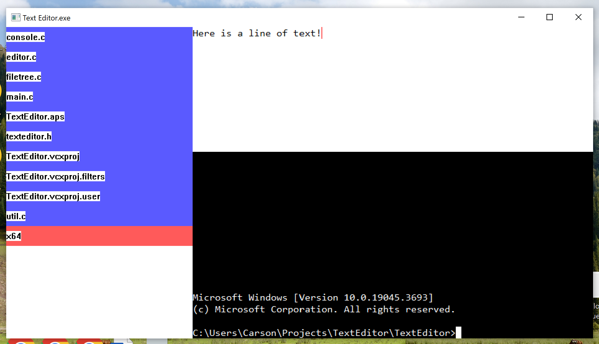

# Text Editor

Wondering how desktop applications are made, I wanted to explore the underlying
technologies and interfaces by making a text editor using only the Win32 API:
Windows' underlying API which all UI applications, through one means or another,
talk to windows to display windows on the screen and interact with the user.
While not being the recommended way of doing this&mdash;as the underlying APIs are
very primitive&mdash;I wanted to try it anyway to see how desktop application
development works at a fundamental level.

## The Application

The application consists of a working file tree, a text editor pane, and a
working cmd console.

Currently, UI improvements are at a low priority for this project as the
graphics and user input have greater need of improvement, but as a (very)
prototypical text editor, it functions sufficiently, being able to read, edit
and save files.
